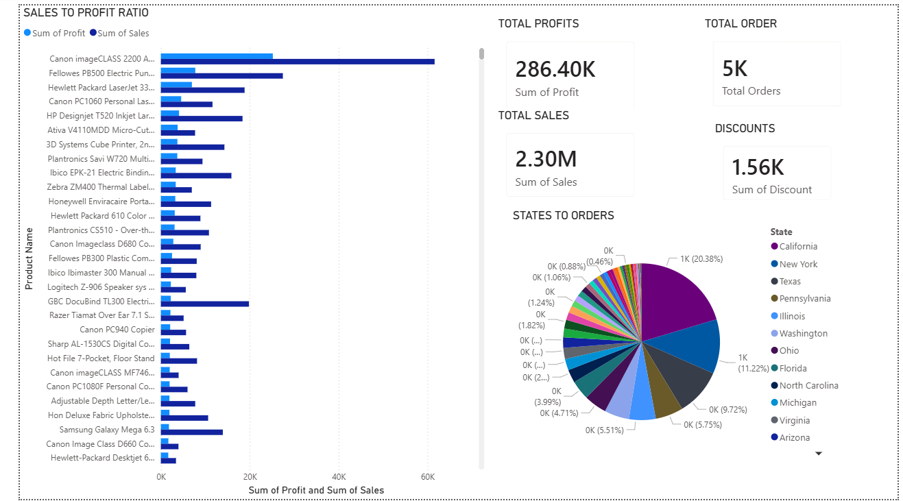
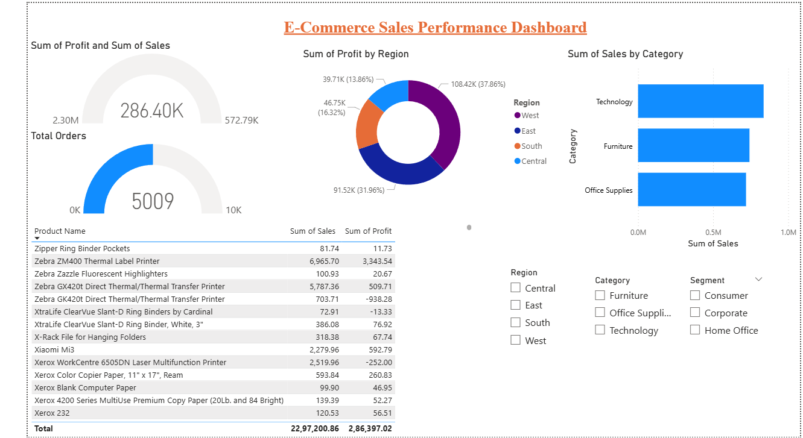

# E-Commerce Sales Analysis Dashboard

## Project Overview
This project analyzes e-commerce sales performance and customer trends using SQL and Power BI.

The dashboard helps identify:
- Sales trends
- Top-performing categories
- Customer purchasing behavior
- Regional performance
- Monthly revenue growth

---

## Tools & Technologies Used
- Power BI
- SQL
- Excel / CSV
- Data Visualization

---

## Key Insights
- Technology category generated highest sales
- Western region contributed maximum revenue
- Seasonal spikes observed during year-end months
- High-profit products identified for business growth

---

## Dashboard Preview

### Dashboard Overview 1

### Dashboard Overview 2

---

## Files Included
- `ecommerce_dashboard.pbix`
- `Sample - Superstore.csv`
- `monthly_revenue.csv`

---

## Skills Demonstrated
- Data Cleaning
- Data Analysis
- Dashboard Development
- SQL Querying
- Business Insights
- Data Visualization

---

## Author
Ashim Chakraborty
